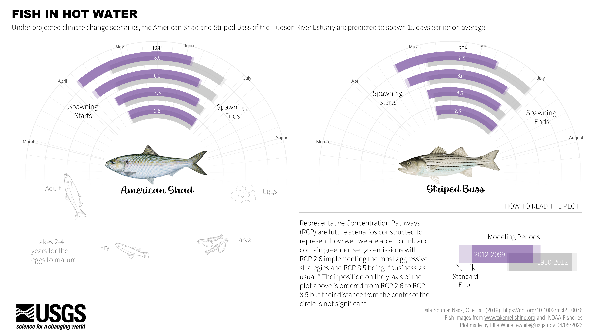
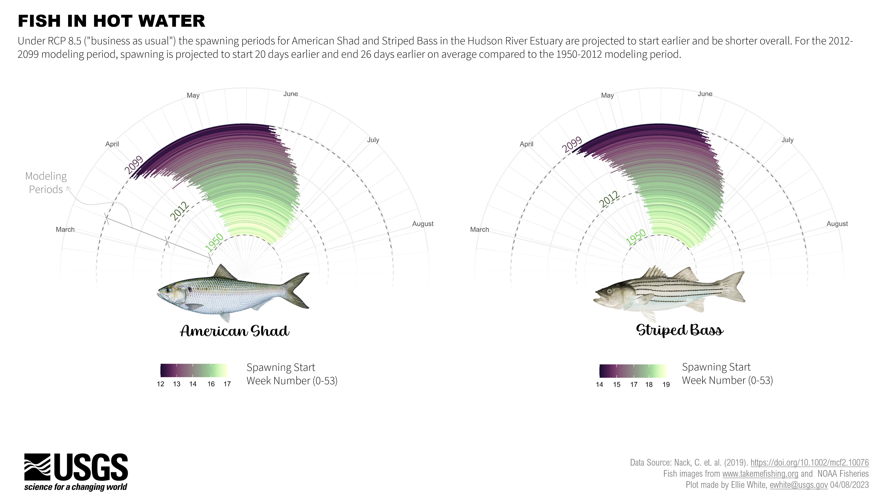

# Chart Challenge 2023 Contribution

Ellie White

Prompt: local change, 04/25/2023

## Image(s) 

## Key Takeaways

1. The American Shad & Striped Bass are migratory fish species that require freshwater and marine habitats to complete their life cycles. These needs make them vulnerable to human activities & climate change.

Extra info: The Hudson River Shad has declined in stock so much that all its fisheries were closed in 2010. The Striped Bass, while declining in relative abundance, still remains the most important game fish in the Hudson River. Native and Colonial Americans fished them for sustenance, smoked the flesh, and ate the roe as a delicacy.

## Data Sources 

*  Nack, C. C., Swaney, D. P., & Limburg, K. E. (2019). Historical and projected changes in spawning Phenologies of American Shad and Striped bass in the Hudson River Estuary. Marine and Coastal Fisheries, 11(3), 271-284. Accessed 04/04/2022.

## Key Programs and/or Packages Used

* sessionInfo() = R version 4.2.3 (2023-03-15 ucrt)
Platform: x86_64-w64-mingw32/x64 (64-bit)
Running under: Windows 10 x64 (build 19045)

Matrix products: default

locale:
[1] LC_COLLATE=English_United States.utf8  LC_CTYPE=English_United States.utf8   
[3] LC_MONETARY=English_United States.utf8 LC_NUMERIC=C                          
[5] LC_TIME=English_United States.utf8

attached base packages:
[1] stats     graphics  grDevices utils     datasets  methods   base     

other attached packages:
 [1] gifski_1.6.6-1  scico_1.3.1     gganimate_1.0.8 scales_1.2.1    forcats_1.0.0  
 [6] stringr_1.5.0   dplyr_1.1.0     purrr_1.0.1     readr_2.1.3     tidyr_1.3.0    
[11] tibble_3.1.8    ggplot2_3.4.0   tidyverse_1.3.2

loaded via a namespace (and not attached):
 [1] progress_1.2.2      tidyselect_1.2.0    xfun_0.36           haven_2.5.1        
 [5] gargle_1.3.0        colorspace_2.1-0    vctrs_0.5.2         generics_0.1.3     
 [9] htmltools_0.5.4     yaml_2.3.7          utf8_1.2.2          rlang_1.0.6        
[13] pillar_1.8.1        withr_2.5.0         glue_1.6.2          DBI_1.1.3          
[17] tweenr_2.0.2        dbplyr_2.3.0        readxl_1.4.1        modelr_0.1.10      
[21] lifecycle_1.0.3     munsell_0.5.0       gtable_0.3.1        cellranger_1.1.0   
[25] rvest_1.0.3         evaluate_0.20       knitr_1.42          tzdb_0.3.0         
[29] fastmap_1.1.0       fansi_1.0.4         broom_1.0.3         backports_1.4.1    
[33] googlesheets4_1.0.1 jsonlite_1.8.4      farver_2.1.1        fs_1.6.0           
[37] hms_1.1.2           digest_0.6.31       stringi_1.7.12      grid_4.2.3         
[41] cli_3.6.0           tools_4.2.3         magrittr_2.0.3      crayon_1.5.2       
[45] pkgconfig_2.0.3     ellipsis_0.3.2      xml2_1.3.3          prettyunits_1.1.1  
[49] reprex_2.0.2        timechange_0.2.0    googledrive_2.0.0   lubridate_1.9.2    
[53] assertthat_0.2.1    rmarkdown_2.20      httr_1.4.4          rstudioapi_0.14    
[57] R6_2.5.1            compiler_4.2.3 

* packages = c("gifski", "scico", "gganimate", "scales", "readr", "tidyverse")

## Overall Process to Create the Viz

1) `rmarkdown` to get data ready 
2) `ggplot` to make base plot 
3) PowerPoint to add chart elements

## Design Considerations

* I included fish images as a welcoming gesture, so, the audience could connect the sicence/data to species that is being studied. I wanted to envoke emotion for their beauty and the vulnerability (art direction). 
* Colors were picked by considering contrast needed for those with visual impairements and/or colorblindness (508 compliance).
* Fonts were chosen and text hierarchy was deliberately designed to guide the eye and progressively deliver information with main takeaway up top. 
* Fish life stages below the data provide more context for general audiences that may not be familiar with the transformations fish go through from egss to adults.  
* Captions, legend, and "how to read the plot" provide extra information about the underlying data meant to be consumed last if users are interested. 
